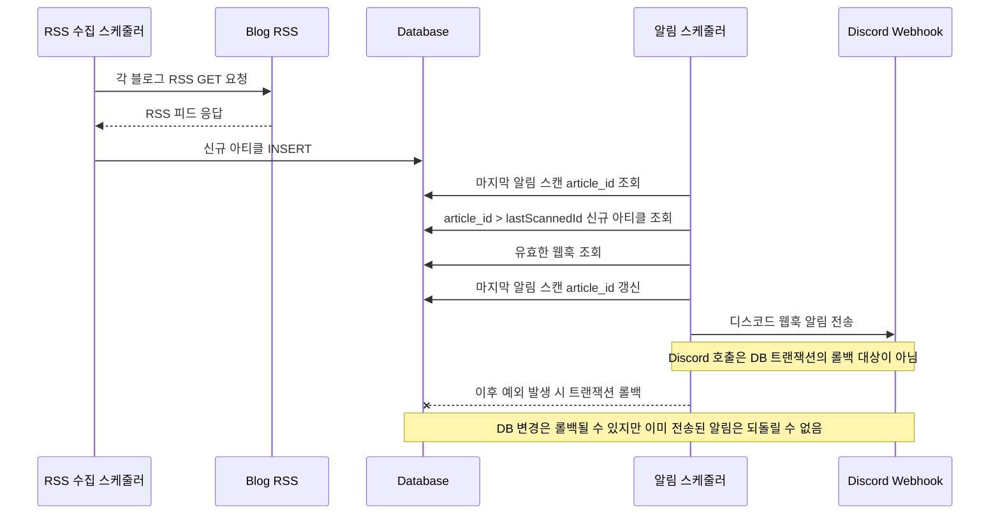
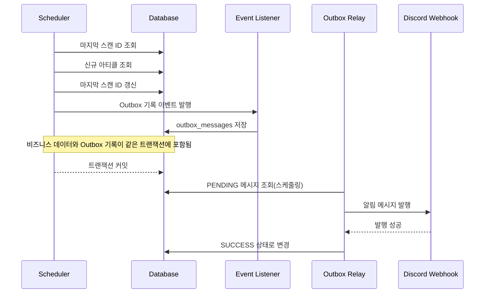
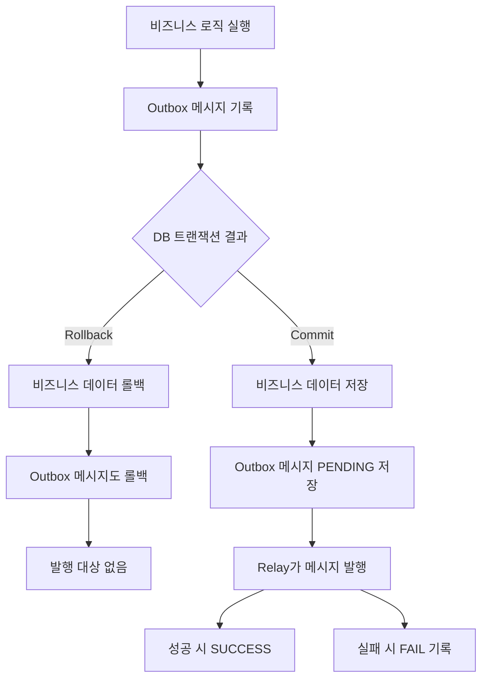

## 문제 상황

[테크모아](https://handev.site/)는 여러 기술 블로그의 RSS를 주기적으로 수집하고, 새 아티클이 발견되면 사용자가 등록한 웹훅으로 알림을 전송하는 서비스다.

처음에는 신규 아티클을 조회하고 마지막 스캔 ID를 갱신한 뒤, 같은 비즈니스 흐름 안에서 알림 메시지를 바로 발행했다.




코드로 보면 대략 다음과 같은 구조였다.

```kotlin
@Transactional
fun execute() {
    val lastScanned = lastScannedArticleUseCase.getLastScannedArticle()

    val newArticles = articleRepository.findByIdGreaterThan(lastScanned.articleId)
    if (newArticles.isEmpty()) return

    val webhooks = webhookRepository.getValidWebhook()
    if (webhooks.isEmpty()) return

    lastScannedArticleUseCase.sync(newArticles.last().articleId)

    webhooks.forEach { webhook ->
        newArticles.forEach { article ->
            webhookMessageBroker.publish(
                OutboxPayload(
                    articleId = article.articleId,
                    title = article.title,
                    link = article.link,
                    pubDate = article.pubDate,
                    blogName = article.blogName,
                    webhookUrl = webhook.url,
                )
            )
        }
    }
}
```

문제는 메시지 발행이 DB 트랜잭션의 관리 대상이 아니라는 점이었다.

예를 들어 `webhookMessageBroker.publish()`가 성공한 뒤 모종의 이유로 트랜잭션이 롤백될 수 있다. 하지만 이미 외부로 발행된 메시지는 되돌릴 수 없다. 그 결과 DB에는 반영되지 않은 신규 아티클 등록 알림이 사용자에게 전송될 수 있다.

반대로 DB 트랜잭션은 커밋되었지만 메시지 발행 중 네트워크 오류가 발생하면, 실제로 존재하는 신규 아티클에 대한 알림이 유실될 수 있다.

즉 비즈니스 로직과 외부 메시지 발행을 하나의 흐름에서 처리하지만, 둘은 같은 트랜잭션 경계 안에서 원자적으로 묶이지 않았다. 이 때문에 DB 상태와 알림 발행 상태 사이의 정합성이 보장되지 않았다.

## 해결 방법

이 문제를 해결하기 위해 Transactional Outbox 패턴을 도입했다.

핵심은 외부 메시지를 트랜잭션 안에서 바로 발행하지 않고, 먼저 DB의 아웃박스 테이블에 `발행해야 할 메시지`를 기록하는 것이다.

비즈니스 로직과 아웃박스 기록은 하나의 트랜잭션 안에서 원자적으로 처리한다. 따라서 트랜잭션이 롤백되면 비즈니스 데이터와 아웃박스 메시지가 함께 롤백된다. 반대로 트랜잭션이 커밋되면, 커밋된 데이터에 대한 메시지만 아웃박스 테이블에 기록된다.



구조는 다음과 같이 변경되었다.

```kotlin
@Transactional
fun execute() {
    val lastScanned = lastScannedArticleUseCase.getLastScannedArticle()

    val newArticles = articleRepository.findByIdGreaterThan(lastScanned.articleId)
    if (newArticles.isEmpty()) return

    val webhooks = webhookRepository.getValidWebhook()
    if (webhooks.isEmpty()) return

    lastScannedArticleUseCase.sync(newArticles.last().articleId)

    // 알림 메시지 생성과 아웃박스 기록 이벤트 발행은 다른 유스케이스로 위임
    newArticlesEventUseCase.publish(newArticles, webhooks)
}
```

아웃박스 메시지 생성과 이벤트 발행 로직은 별도 `NewArticlesEventUseCase`로 분리했다. `ScanNewArticlesService`는 신규 아티클을 조회하고 마지막 스캔 ID를 갱신하는 비즈니스 흐름에 집중하고, 알림 메시지를 어떤 형태로 만들고 아웃박스에 기록할지는 별도 유스케이스가 담당하도록 역할을 나눴다.

이를 통해 비즈니스 로직 안에 메시지 payload 생성, idempotency key 생성, 이벤트 발행 같은 부가 로직이 섞이지 않도록 했다. 또한 이후 알림 메시지 구조가 바뀌거나 발행 대상이 늘어나더라도 스캔 로직 자체를 크게 변경하지 않고, 메시지 발행 준비 로직만 수정할 수 있다.

즉, `NewArticlesEventUseCase`는 발행해야 할 메시지를 만들고 이벤트로 전달하는 책임을 가진다.

```kotlin
fun publish(newArticles: List<NewArticleDto>, webhooks: List<Webhook>) {
    val messages = arrayListOf<NewArticlesOutboxMessage>()

    webhooks.forEach { webhook ->
        newArticles.forEach { article ->
            messages.add(
                NewArticlesOutboxMessage(
                    ...
                )
            )
        }
    }

	// 신규 아티클 저장 이벤트 발행
    eventPublisher.publishEvent(OutboxMessages(messages))
}
```

이 이벤트는 트랜잭션 커밋 전에 처리되도록 했다.

```kotlin
@TransactionalEventListener(phase = TransactionPhase.BEFORE_COMMIT)
@Transactional(propagation = Propagation.MANDATORY)
fun recordMessage(messages: OutboxMessages) {
    outboxRepository.save(messages)
}
```

`Propagation.MANDATORY`를 사용해 아웃박스 저장 로직이 반드시 기존 트랜잭션 안에서만 실행되도록 했다. 트랜잭션이 없는 상태에서 호출되면 예외가 발생하므로, 아웃박스 메시지만 단독으로 저장되는 상황을 방지할 수 있다.

또한 `@TransactionalEventListener(phase = TransactionPhase.BEFORE_COMMIT)`를 사용해 트랜잭션 커밋 직전에 아웃박스 메시지를 저장하도록 했다. 이 시점에 저장된 아웃박스 메시지는 비즈니스 데이터 변경과 같은 트랜잭션에 포함된다.

즉, 비즈니스 로직과 아웃박스 기록이 하나의 트랜잭션 안에서 원자적으로 동작한다. 트랜잭션이 커밋되면 둘 다 함께 반영되고, 롤백되면 둘 다 취소된다.

이후 실제 메시지 전송은 DB를 폴링하는 별도 디스패처가 담당하도록 구현했다. 디스패처는 2분마다 `PENDING` 상태의 아웃박스 메시지를 조회해 메시지를 발행하고 처리 결과에 따라 상태를 갱신한다.

```kotlin
fun dispatchPending() {
    val pendingMessages = outboxRepository.claimPending()
    if (pendingMessages.isEmpty()) return

    pendingMessages.forEach { message ->
        try {
            val payload = objectMapper.readValue<OutboxPayload>(message.payload)

            messageBroker.publish(payload)

            outboxRepository.markSuccess(message.outboxMessageId)
        } catch (ex: Exception) {
            outboxRepository.markFailed(
                message.outboxMessageId,
                ex.message?.take(1000) ?: "Unknown error"
            )
        }
    }
}
```

디스패처는 `PENDING` 상태의 아웃박스 메시지를 조회하고, 메시지 발행에 성공하면 `SUCCESS`로 변경한다. 실패하면 메시지를 삭제하지 않고 `FAIL` 상태와 에러 메시지를 남긴다.

## 결과

이 구조로 바꾸면서 메시지 발행의 기준점을 DB 커밋 이후로 옮길 수 있었다.

트랜잭션이 롤백되면 아웃박스 메시지도 함께 롤백되므로, 커밋되지 않은 데이터에 대한 알림이 발행 대상에 포함되지 않는다. 반대로 트랜잭션이 커밋되면 아웃박스에 메시지가 남기 때문에, 이후 디스패처가 이를 조회해 발행할 수 있다.



또한 메시지 발행 실패를 단순 예외로 끝내지 않고 DB에 상태로 남길 수 있게 되었다. 실패한 메시지는 `FAIL` 상태와 에러 메시지를 통해 추적할 수 있고, 이후 재처리나 메시지큐 도입 등으로 확장할 수 있게 되었다.

개선된 점을 정리하면 아래와 같다.

- **비즈니스 로직과 아웃박스 기록을 하나의 트랜잭션으로 묶었다.**
- **커밋된 데이터에 대한 메시지만 발행 대상이 되어 정합성이 보장된다.**
- **메시지 발행 실패 시 원인을 추적할 수 있다.**
- **알림 발행 로직을 비즈니스 로직에서 분리해 DB 커넥션의 장기 점유도 예방되었다.**

## 부족한 점

모든 장애 상황을 완전히 해결하는 것은 아니다. 현재 작업은 비즈니스 트랜잭션과 아웃박스 기록을 원자적으로 수행하여 트랜잭션 롤백으로 인한 DB와 디스코드 알림 사이의 정합성 문제를 해결한 것이다.

다만 실제 메시지 발행을 안정적으로 운영하려면 다음과 같은 부분을 개선해야 한다.

- **아웃박스 릴레이 구현**
	- 디스코드 웹훅 전송은 외부 HTTP 요청이므로, 알림 대상이 많아질수록 스케줄러에 부하가 집중될 수 있다.
	- 이후에는 별도 릴레이가 아웃박스 메시지를 메시지큐로 전달하고, 소비자가 웹훅 전송을 비동기로 처리하는 구조로 개선하면 부하를 줄일 수 있다.

- **메시지 처리 상태 관리**
	- 릴레이가 메시지를 발행할 때 `PENDING`, `PUBLISHING`, `SUCCESS`, `FAIL` 같은 상태 전이를 명확히 관리해야 한다.
	- 특히 `PUBLISHING` 상태는 릴레이가 특정 메시지를 처리 중임을 표시하기 위해 필요하다.
	- 릴레이가 여러 개 실행되거나 스케줄러 실행 시간이 겹칠 경우, 같은 `PENDING` 메시지를 여러 릴레이가 동시에 조회해 중복 발행할 수 있다.
	- 따라서 메시지를 발행하기 전에 `PENDING -> PUBLISHING`으로 변경해 다른 릴레이가 같은 메시지를 가져가지 못하도록 해야 한다.
	- 단, `PUBLISHING` 상태에서 프로세스가 종료될 수 있으므로 일정 시간 이상 처리 중인 메시지를 다시 복구하는 전략도 함께 필요하다.
- **재시도 정책**
	- 메시지 발행 실패가 일시적인 네트워크 오류일 수 있으므로 즉시 실패 처리하기보다 재시도 전략이 필요하다.
- **DLQ 도입**
	- 최대 재시도 횟수를 초과한 메시지는 계속 재처리하지 않고 별도 DLQ로 격리해야 한다.

- **중복 발행 대비**
	- 메시지 발행은 장애 복구나 재시도 과정에서 중복될 수 있다.
	- 소비자 쪽에서 중복 메시지 처리를 방지해야 한다.

## 참고

- [트랜잭셔널 아웃박스 패턴의 실제 구현 사례 (29CM)](https://medium.com/@greg.shiny82/%ED%8A%B8%EB%9E%9C%EC%9E%AD%EC%85%94%EB%84%90-%EC%95%84%EC%9B%83%EB%B0%95%EC%8A%A4-%ED%8C%A8%ED%84%B4%EC%9D%98-%EC%8B%A4%EC%A0%9C-%EA%B5%AC%ED%98%84-%EC%82%AC%EB%A1%80-29cm-0f822fc23edb)
- [Spring @TransactionalEventListener](https://www.baeldung.com/spring-events)